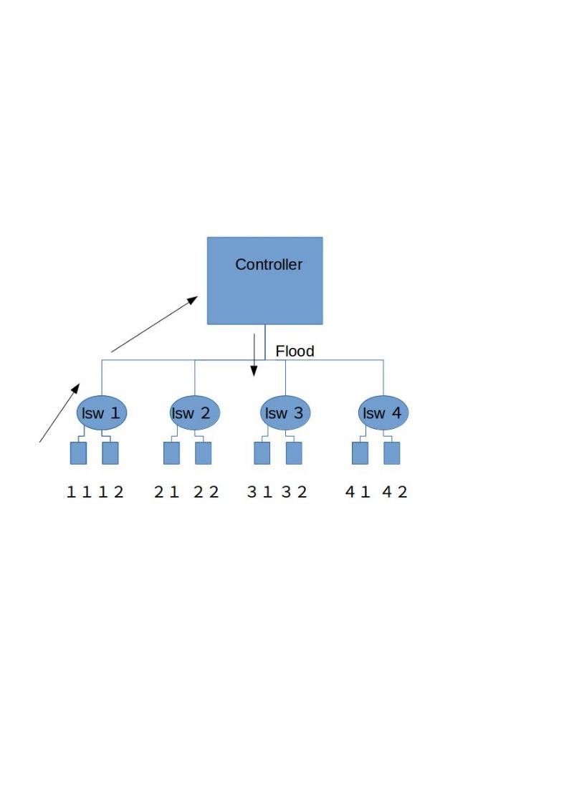
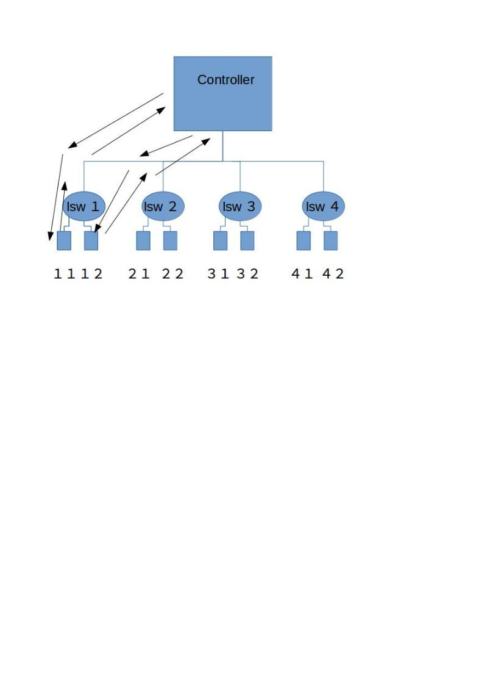

# Report: Learning Switch #

Date: 24.10.2016 <br />
Name: Jens Oetjen <br />
Student Number: 33E16024 <br />

## 1 Introduction ##

In this report I will describe how the ruby program "multi_learning_switch.rb" works. I will show how the forwarding database (FDB) is 
managed and how the communication between the switch and the controller is handled.

## 2 Header and fdb ##

The path starts by requiring the file "fdb". This file acts as a database and stores pairs of MAC address and port number:

```ruby
require 'fdb'
```

The values are stored with a hashtable. Following, I will explain how the database is accessed (This is code from the fdb-file). 
The entries are inserted into the database by the function "learn":

```ruby
def learn(mac, port_no)
    entry = @db[mac]
    if entry
      entry.update port_no
    else
      @db[mac] = Entry.new(mac, port_no)
    end
  end
```
Entries are removed from the database when their expiry time is reached. When the database is initialized, an expiry time is chosen. 
Entries whose last-update is older than the expiry time, will be removed. The functions reponsible for this behaviour are "aged-out" 
(compares last update and expiry time) and "age" (deletes the entry from the database). 

```ruby
def aged_out?
      Time.now - @last_update > @age_max
    end
    ```
  
  ```ruby
def age
    @db.delete_if { |_mac, entry| entry.aged_out? }
 end
 ```

## 3 Initializition ##

The function "start" initializes the switch by creating a hashtable:

```ruby
 @fdbs = {}
```

The hash table is populated with an instance of the former explained database in the "switch_ready"-function:


## 4 Functions ##

```ruby
@fdbs[datapath_id] = FDB.new
```
When a packet arrives at the switch, the function "packet in". If neceesary, a new entry is created in the database
for the corresponding port to the given mac-address. This is done by calling the "learn"-function from the fdb-file.
(I do not what  "know packet_in.destination_mac.reserved" does, I could not find an english documentation). In the next step, the function
"flow_mod_and_packet"_out is called:

```ruby
def packet_in(datapath_id, packet_in)
    return if packet_in.destination_mac.reserved?
    @fdbs.fetch(datapath_id).learn(packet_in.source_mac, packet_in.in_port)
    flow_mod_and_packet_out packet_in
  end
 ```

The "def flow_mod_and_packet_out" function checks first if an entry can be found for the given destination mac-address.
If an entry could be found, the message is sent to that port. If no entry could be found, the message is flooded instead (packet out).	
Moreover, an entry is the flow table is created (flow mod):

```ruby
 def flow_mod_and_packet_out(packet_in)
    port_no = @fdbs.fetch(packet_in.dpid).lookup(packet_in.destination_mac)
    flow_mod(packet_in, port_no) if port_no
    packet_out(packet_in, port_no || :flood)
end
 ```
	
The function responsible for creating a entry in the flow table is written in such a way that only entries that are indentical
are counted as belonging to the follow (the definition of "identical" in this context can be found in the slides of week 2). This
is realized by using "ExactMatch". The corresponding action to this is "SendOutPort": 
	
	  
```ruby
  match: ExactMatch.new(packet_in),
      actions: SendOutPort.new(port_no)
 ```
The function "packet out" is responsible for the actual sending of the message. It uses the incoming message and the "new port" as 
parameters and sends the message out from the new port. 
	
  
 ```ruby
def packet_out(packet_in, port_no)
    send_packet_out(
      packet_in.datapath_id,
      packet_in: packet_in,
      actions: SendOutPort.new(port_no)
    )
  end
 ```
	
If an entry within the flow table already exists, the switch will will not send a "Packet in"-message to the controller.
	
	
Following I will my illustrate m explanations with an example. I used the default config file:
	
```ruby
def age
 vswitch('lsw1') { datapath_id 0x1 }
vswitch('lsw2') { datapath_id 0x2 }
vswitch('lsw3') { datapath_id 0x3 }
vswitch('lsw4') { datapath_id 0x4 }

vhost('host1-1')
vhost('host1-2')
vhost('host2-1')
vhost('host2-2')
vhost('host3-1')
vhost('host3-2')
vhost('host4-1')
vhost('host4-2')

link 'lsw1', 'host1-1'
link 'lsw1', 'host1-2'
link 'lsw2', 'host2-1'
link 'lsw2', 'host2-2'
link 'lsw3', 'host3-1'
link 'lsw3', 'host3-2'
link 'lsw4', 'host4-1'
link 'lsw4', 'host4-2'

  end
 ```
	
In a first example I send a packet from host1-1 to host 1-2 and look at the stats and the flow afterwards. I used the following commands:

```	
root@Jens-Oetjen-PC:/home/jens/Desktop/lesson2/switch2/learning_switch# ./bin/trema send_packets --source host1-1 --dest host1-2 --npackets 10
root@Jens-Oetjen-PC:/home/jens/Desktop/lesson2/switch2/learning_switch# ./bin/trema show_stats host1-1
Packets sent:
  192.168.0.1 -> 192.168.0.2 = 10 packets
root@Jens-Oetjen-PC:/home/jens/Desktop/lesson2/switch2/learning_switch# ./bin/trema show_stats host1-2
Packets received:
  192.168.0.1 -> 192.168.0.2 = 10 packets
root@Jens-Oetjen-PC:/home/jens/Desktop/lesson2/switch2/learning_switch# trema dump_flows lsw1
 ```
 
 The following (extremely ugly) diagram illustrates what is happening:
 
<p align="center">
  
  </p>

 
 It is obvious that an entry in the flow entry was not yet created. The controller floods the packet.
 However, after sending a packet back the same way. A flow entry is created. This can be seen in the following commands:
 
  ```
  root@Jens-Oetjen-PC:/home/jens/Desktop/lesson2/switch2/learning_switch# ./bin/trema send_packets --source host1-2 --dest host1-1 --npackets 10
root@Jens-Oetjen-PC:/home/jens/Desktop/lesson2/switch2/learning_switch# ./bin/trema show_stats host1-1
Packets sent:
  192.168.0.1 -> 192.168.0.2 = 10 packets
Packets received:
  192.168.0.2 -> 192.168.0.1 = 10 packets
root@Jens-Oetjen-PC:/home/jens/Desktop/lesson2/switch2/learning_switch# ./bin/trema show_stats host1-2
Packets sent:
  192.168.0.2 -> 192.168.0.1 = 10 packets
Packets received:
  192.168.0.1 -> 192.168.0.2 = 10 packets
root@Jens-Oetjen-PC:/home/jens/Desktop/lesson2/switch2/learning_switch# trema dump_flows lsw1cookie=0x0, duration=40.575s, table=0, n_packets=9, n_bytes=378, idle_age=40, priority=65535,udp,in_port=2,vlan_tci=0x0000,dl_src=fc:11:59:cf:cb:18,dl_dst=de:1d:ae:6d:d6:dd,nw_src=192.168.0.2,nw_dst=192.168.0.1,nw_tos=0,tp_src=0,tp_dst=0 actions=output:1
   ```
 Illustration:
 
 <p align="center">
  
  </p>

	