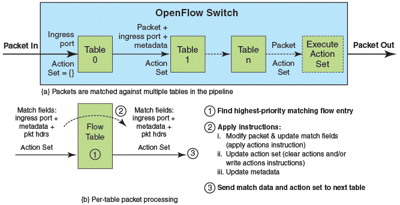

# Report: Multiple tables #

Date: 31.10.2016 <br />
Name: Jens Oetjen <br />
Student Number: 33E16024 <br />

## 1 General information ##

In OpenFlow 1.3, allwie s incoming packets have to go through a pipeline of multiple tables one after another. Packets are sent from one
table to the next when they match the relevant rule. If a table has multiple rules, the rules with the highest priority are applied first. 
The following picture (reference is at the bottom of this report) shows the process:

<p align="center">
  
</p>

## 2 Function for port mirroring ##

In the given task, the switch was started with the following command: 

```
root@Jens-Oetjen-PC:/home/jens/Desktop/lesson3/switchv2/learning_switch# bundle exec trema rulib/learning_switch13.rb --openflow13 -c trema.conf
 ```
In the second terminal, I used the dump command which displays the flows. The output was as follows: 

```
root@Jens-Oetjen-PC:/home/jens/Desktop/lesson3/switchv2/learning_switch# ./bin/trema dump_flows lsw
cookie=0x0, duration=5.148s, table=0, n_packets=0, n_bytes=0, priority=2,dl_dst=01:00:00:00:00:00/ff:00:00:00:00:00 actions=drop
cookie=0x0, duration=5.110s, table=0, n_packets=0, n_bytes=0, priority=2,dl_dst=33:33:00:00:00:00/ff:ff:00:00:00:00 actions=drop
cookie=0x0, duration=5.110s, table=0, n_packets=0, n_bytes=0, priority=1 actions=goto_table:1
cookie=0x0, duration=5.110s, table=1, n_packets=0, n_bytes=0, priority=3,dl_dst=ff:ff:ff:ff:ff:ff actions=FLOOD
cookie=0x0, duration=5.110s, table=1, n_packets=0, n_bytes=0, priority=1 actions=CONTROLLER:65535
  ```
  
It is evident that two tables exist, table 0 and table 1. Packets arrive in table 0 first. Within a table, the rule priority decides
the order in which actions are matched. The drop rules in table 0 have the highest order. If a packet matches these rules (
if it has the MAC address 01:00:00:00:00:00/ff:00:00:00:00:00 or 33:33:00:00:00:00/ff:ff:00:00:00:00)
it is discarded and never reaches the next table. If none of the these rules are matched, the packet matches the third rule and
it is further processed in table 1. The rule with the highest priority in table 1 affixes the "Flood" action to all packets. The remaining
rule forwards the remaining packets to the controller. 

After sending packets between host 1 and 2, the output from the dump-command has changed:

```	
root@Jens-Oetjen-PC:/home/jens/Desktop/lesson3/switchv2/learning_switch# ./bin/trema send_packets --source host1 --dest host2
root@Jens-Oetjen-PC:/home/jens/Desktop/lesson3/switchv2/learning_switch# ./bin/trema send_packets --source host2 --dest host1
root@Jens-Oetjen-PC:/home/jens/Desktop/lesson3/switchv2/learning_switch# ./bin/trema dump_flows lsw
cookie=0x0, duration=2420.241s, table=0, n_packets=0, n_bytes=0, priority=2,dl_dst=01:00:00:00:00:00/ff:00:00:00:00:00 actions=drop
cookie=0x0, duration=2420.203s, table=0, n_packets=0, n_bytes=0, priority=2,dl_dst=33:33:00:00:00:00/ff:ff:00:00:00:00 actions=drop
cookie=0x0, duration=2420.203s, table=0, n_packets=2, n_bytes=84, priority=1 actions=goto_table:1
cookie=0x0, duration=2420.203s, table=1, n_packets=0, n_bytes=0, priority=3,dl_dst=ff:ff:ff:ff:ff:ff actions=FLOOD
cookie=0x0, duration=58.995s, table=1, n_packets=0, n_bytes=0, idle_timeout=180, priority=2,in_port=2,dl_src=23:dc:e2:e1:76:f8,dl_dst=5d:bf:dc:c2:b4:a6 actions=output:1
cookie=0x0, duration=2420.203s, table=1, n_packets=2, n_bytes=84, priority=1 actions=CONTROLLER:65535

 ```
 
It is evident, that the 2 packtes have been matched to the third 3 rule and have been forward to table 1. In table 1 theses packets 
matched to the last rule and were sent to the controller. 

If packets had matched to one of the first two rules, they would never have reached the second table. I tried to test this but I was not 
able to send packets to the "forbidden" MAC addresses.

[Source](http://www.brocade.com/content/html/en/configuration-guide/nos-601a-sdnguide/GUID-3CBDC5D1-C379-4CE2-9B5A-36DFDE4B57A4.html)